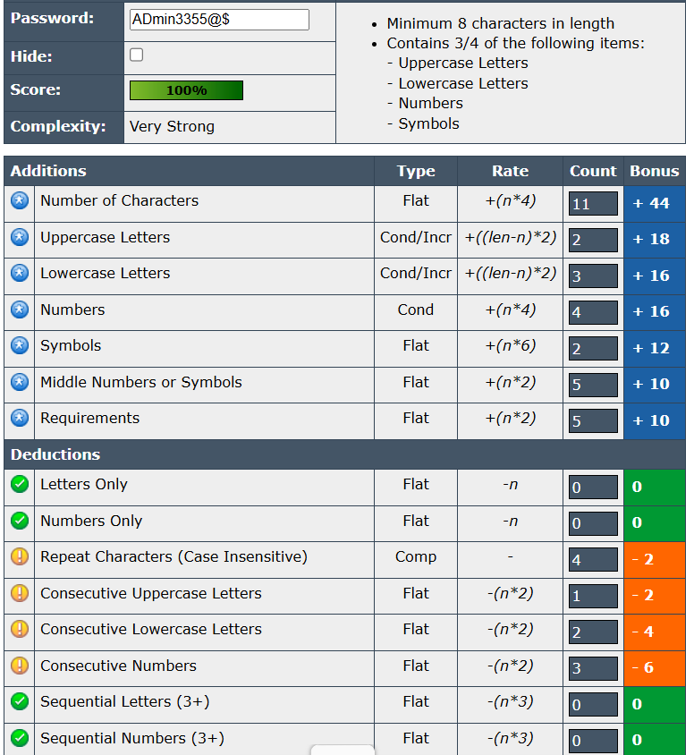
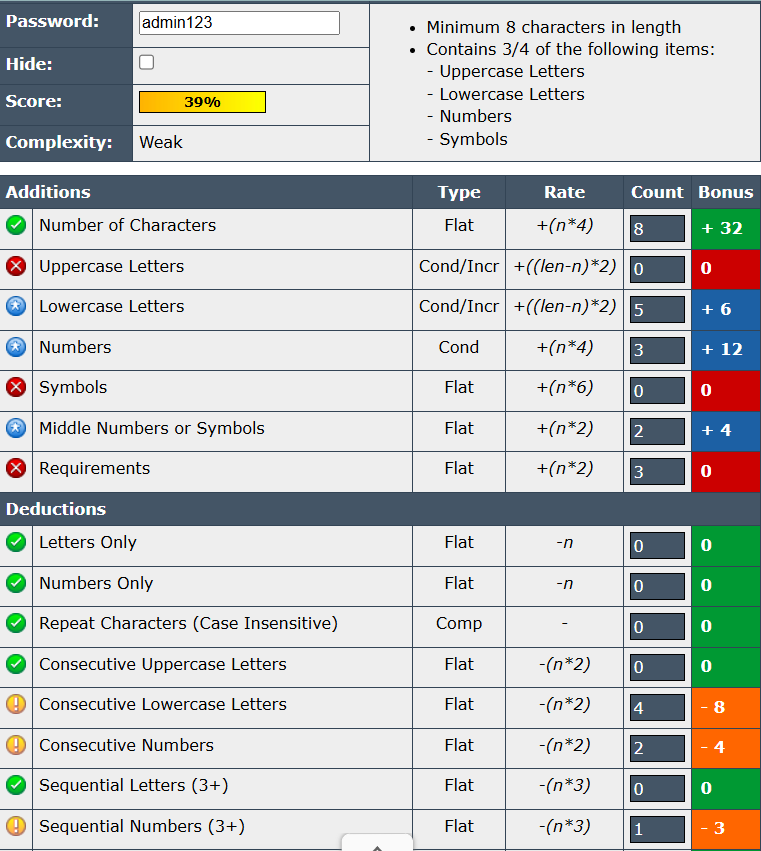
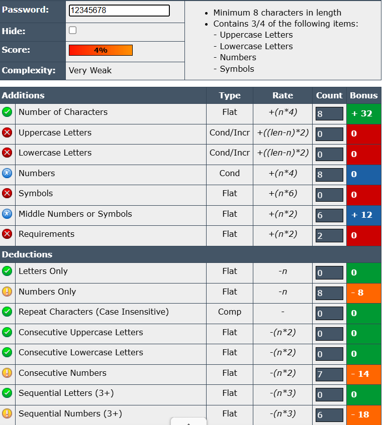

# Task 6: Password Strength Evaluation

## Objective
Understand what makes a password strong and test it against password strength tools.

## Tools Used
- [Password Meter](https://passwordmeter.com/)

## Passwords Tested
1. **ADmin3355@$** – Very Strong (Score: 100%)
2. **admin123** – Weak (Score: 39%)
3. **12345678** – Very Weak (Score: 4%)

## Screenshots
### Strong Password

### Weak Password

### Very Weak Password

## Analysis
- **Strong Password (ADmin3355@$)**  
  - Uses uppercase, lowercase, numbers, symbols  
  - 11 characters long  
  - Avoids common patterns and sequences  
  - Meets multiple complexity requirements  

- **Weak Password (admin123)**  
  - Only lowercase and numbers  
  - Lacks symbols and uppercase letters  
  - Common dictionary word + number pattern  

- **Very Weak Password (12345678)**  
  - Only numbers  
  - Sequential digits make it vulnerable to brute-force attacks  
  - Extremely common in password leaks  

## Best Practices for Strong Passwords
1. Use at least **12 characters**.
2. Include a mix of **uppercase, lowercase, numbers, and symbols**.
3. Avoid dictionary words, names, or predictable patterns.
4. Do not reuse old passwords.
5. Use passphrases or random combinations.
6. Consider using a **password manager** to store and generate secure passwords.

## Common Password Attacks
- **Brute Force Attack**: Trying all possible combinations.
- **Dictionary Attack**: Using a precompiled list of common words.
- **Credential Stuffing**: Using leaked passwords from other breaches.
- **Phishing**: Tricking users into revealing their passwords.

## Conclusion
Password complexity greatly improves security by increasing resistance to brute-force and dictionary attacks. A strong password should balance length, randomness, and variety of characters.
